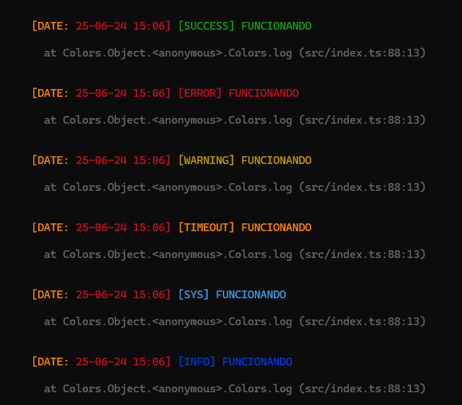

# ColorsLog

A utility for logging colored messages to the console with different system message types.

## Installation

Install the package via npm:

```bash
npm install @gamastudio/colorslog
```

```bash
pnpm i @gamastudio/colorslog
```

## Usage

### Import the module

First, import the `colors` instance from the module:

```typescript
import { colors, SystemMessageType } from '@gamastudio/colorslog';
```

### Logging Messages

You can log messages of different types using the provided methods:

```typescript
colors.system('System message');
colors.info('Information message');
colors.success('Success message');
colors.error('Error message');
```

### Custom Logging

You can also use the `sys` method to log messages with custom types:

```typescript
colors.sys(SystemMessageType.WARNING, 'Warning message');
colors.sys(SystemMessageType.TIMEOUT, 'Timeout message');
```

### Clear Console

You can clear the console using the `clear` method:

```typescript
colors.clear();
```

### Show/Hide Date

You can choose to show or hide the date in the logs:

```typescript
colors.info('Information message without date', false);
colors.error('Error message with date', true);
```

## SystemMessageType

The `SystemMessageType` enumeration provides predefined types of messages:

```typescript
enum SystemMessageType {
  SYS = 'SYS',
  ERROR = 'ERROR',
  WARNING = 'WARNING',
  INFO = 'INFO',
  SUCCESS = 'SUCCESS',
  TIMEOUT = 'TIMEOUT',
  
}
```

## Colors Class

### Propertiess
- `colors`: `{ [key: string]: string }` - Map of ANSI escape codes for various colors and styles.

### Methods

- `log(color: string, text: string, showDate: boolean = true)`: Logs a message to the console with the specified color.
- `sys(type: string, text: string | object | any, showDate: boolean = true)`: Logs a system message with a color based on the type.
- `system(text: string, showDate: boolean = true)`: Logs a system message of type `SYS`.
- `info(text: string, showDate: boolean = true)`: Logs an informational message.
- `success(text: string, showDate: boolean = true)`: Logs a success message.
- `error(text: string | any, showDate: boolean = true)`: Logs an error message.
- `clearConsole()`: Clears the console.

## Example

Here's an example of how to use the `colorslog` package:

```typescript
import { colors } from '@gamastudio/colorslog';

colors.success('Success message');
colors.timeout('Success message');
colors.system('System message');
colors.info('Information message');
colors.error('Error message');
colors.warn('Custom warning message');
colors.clearConsole();
colors.info('Information message without date', false);
colors.error('Error message with date', true);
```



## License
This project

 is licensed under the MIT License.
```

Con estas mejoras, tu librería tendrá más funcionalidad y flexibilidad, permitiendo a los usuarios personalizar aún más sus mensajes en consola. ¿Te gustaría añadir algo más o tienes alguna otra idea específica en mente?